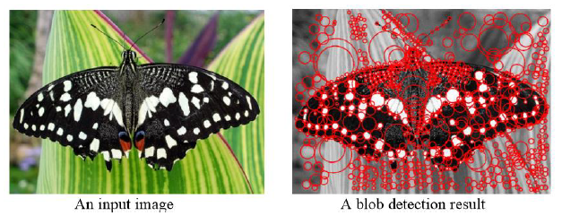

# Laplacian-Blob-Detector
## Introduction

As illustrated by the below two images, the objective of this project is to implement a Laplacian blob detector.

## Design

1. Generate a Laplacian of Gaussian filter: Use MATLAB built-in function “fspecial” to generate LoG filter.
2. Build a Laplacian scale space, starting with some initial scale and going for 𝑛 iterations.
3. Perform non-maximum suppression in scale space.
4. Display resulting circles at their characteristic scales

## Result

You can check the images in the results file.

## Conclusion

1. Larger sigma detects significant features. Smaller sigma detects fine features.
2. As the range of scale and iterations increase, the elapsed time increases.
3. As the threshold increases, the result displays more significant features.
4. The choice of each variation depends on desired behavior.
